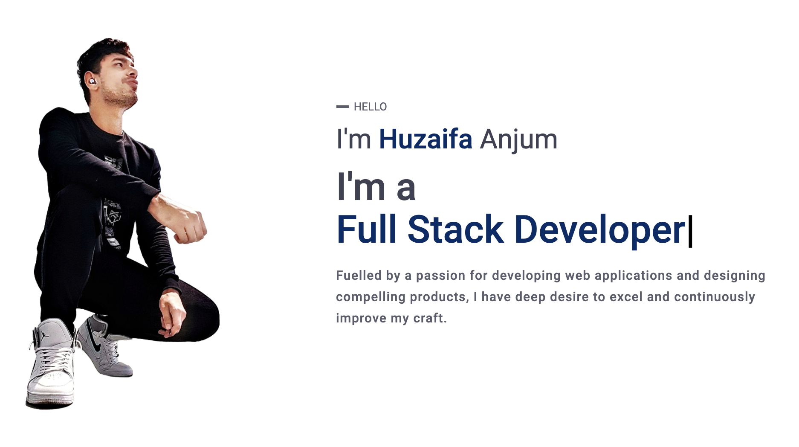

Visitors:
 

# Huzaifa's GitHub Portfolio

Welcome to my GitHub portfolio! I'm Huzaifa, and I'm passionate about software devlopment. Here you'll find a collection of my projects and contributions.

## About Me

I am a Masters of Applied Computer Science student at Concordia University based in Montreal, Canada. I enjoy building intutive apps and constantly seek to learn and grow in the field of Computer Science. 

## Skills

| Programming Languages | UI/UX         | Frontend Technologies | API Technologies | Databases          | Cloud     | CI/CD           | Tools        | User Engagement           |
|-----------------------|---------------|-----------------------|-------------------|---------------------|-----------|-----------------|--------------|---------------------------|
| Python                | Figma         | React Native               | Asp.Net Core      | Cassandra           | Azure     | Azure DevOps    | Postman      | Google Tag Manager        |
| Java                  | Adobe XD      | React JS            | Entity Framework  | Cosmos DB           | Firebase  |                 | Git          | Google Analytics          |
| C#                    |               | Angular 2+             | ADO.Net           | MongoDB             |   Docker        |                 | Jira         | Microsoft Clarity         |
| C++                   |               | ExpressJS               | xUnit             | MS SQL Server       |           |                 | Jupyter      |                           |
| HTML/CSS              |  | Jasmine                 | ExpressJS         | MySQL               |           |                 | LaTeX        |                           |
| JavaScript            |               | Karma          | NodeJS            |                     |           |                 |              |                           |
| TypeScript            |               |                       | PHP               |                     |           |                 |              |                           |
| SQL                   |               |                       |                   |                     |           |                 |              |                           |
|                       |               |                       |                   |                     |     |                 |              |                           |

 

## Stats

 

## Contact Me

 
 
Feel free to explore my projects and reach out to me if you have any questions or collaboration opportunities!
